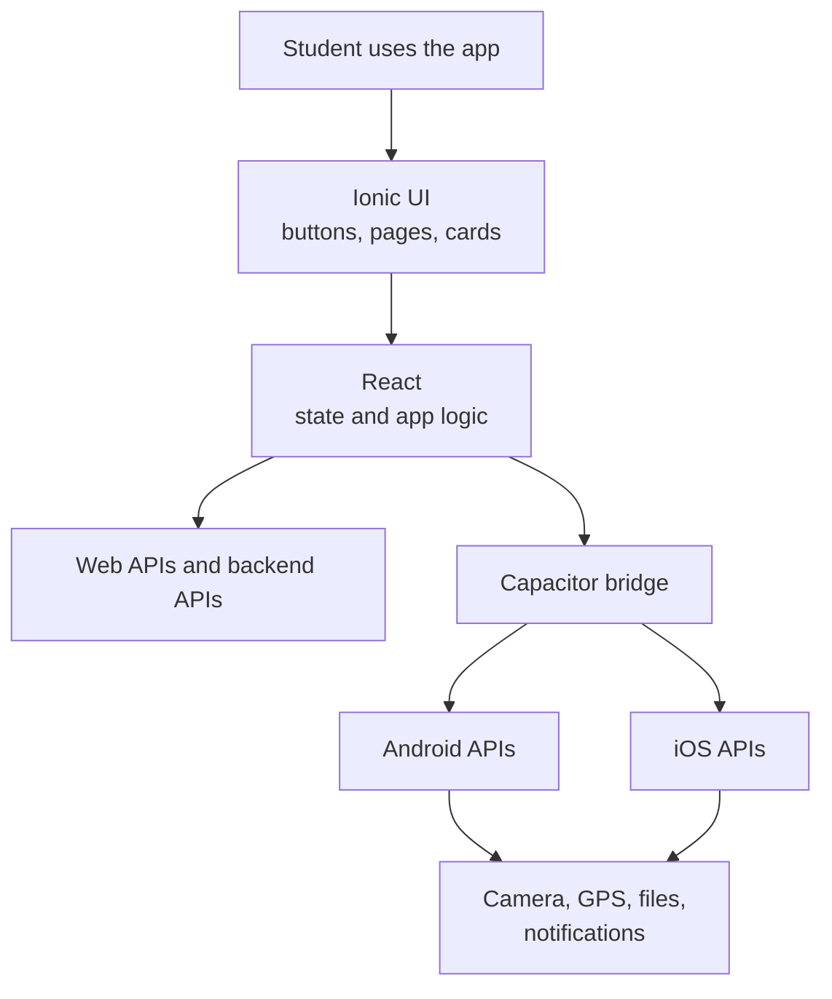
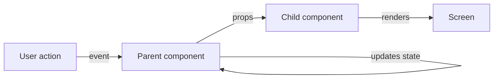
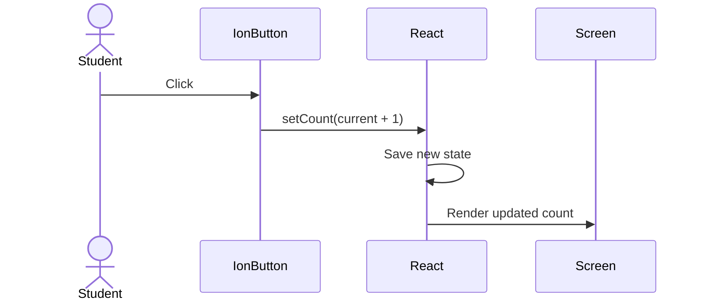
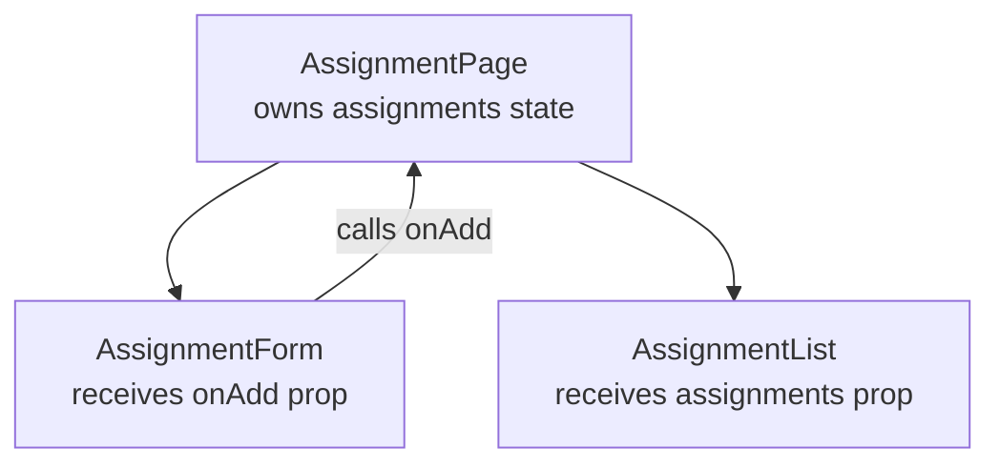
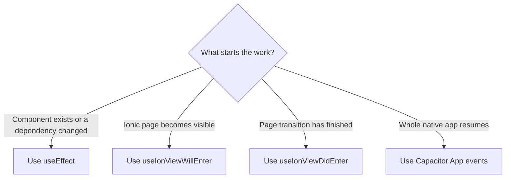
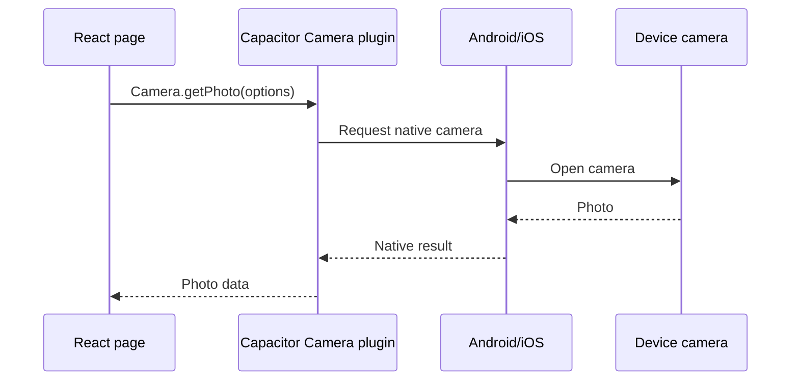
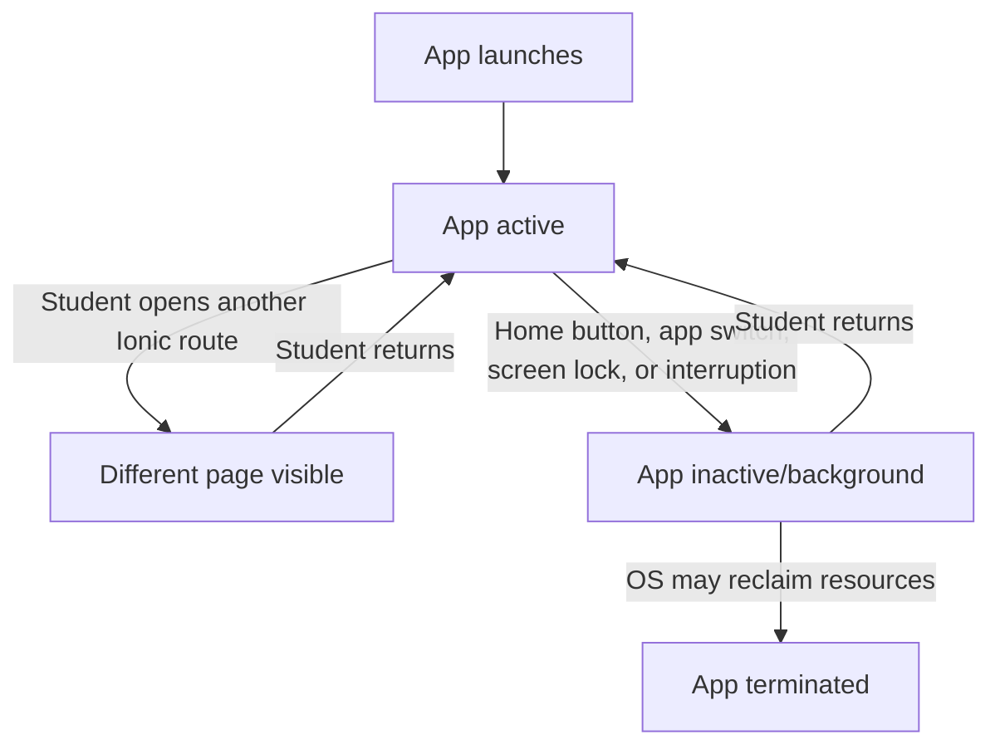

# Ionic Framework + React + Capacitor: End-to-End Tutorial & Command Cheatsheet

> **Stack:** Ionic Framework + React + TypeScript + Capacitor  
> **Goal:** Build a production-style mobile application that runs on the Web, Android, and iOS from one codebase.

Ionic provides the UI toolkit and mobile-oriented interaction model. Ionic React integrates Ionic components with React. Capacitor provides the native runtime and plugin APIs that let the web application access native device capabilities. The current official documentation lists Ionic Framework v9 and Capacitor v8, so this guide uses the current CLI patterns while avoiding unnecessary version pinning. 

---

## Table of Contents

1. [Architecture](#1-architecture)
2. [Prerequisites](#2-prerequisites)
3. [Create a New Ionic React App](#3-create-a-new-ionic-react-app)
4. [Project Structure](#4-project-structure)
5. [Run the Application](#5-run-the-application)
6. [Ionic Page Fundamentals](#6-ionic-page-fundamentals)
7. [Ionic Components](#7-ionic-components)
8. [Alerts](#8-alerts)
9. [Action Sheets](#9-action-sheets)
10. [Toast Messages](#10-toast-messages)
11. [Loading Indicators](#11-loading-indicators)
12. [Modals](#12-modals)
13. [Forms and Validation](#13-forms-and-validation)
14. [Navigation and Routing](#14-navigation-and-routing)
15. [Tabs](#15-tabs)
16. [Menus](#16-menus)
17. [React State and Ionic UI](#17-react-state-and-ionic-ui)
18. [Ionic Lifecycle Events](#18-ionic-lifecycle-events)
19. [HTTP/API Calls](#19-httpapi-calls)
20. [Environment Configuration](#20-environment-configuration)
21. [Add Capacitor](#21-add-capacitor)
22. [Android](#22-android)
23. [iOS](#23-ios)
24. [Capacitor Sync / Copy / Update](#24-capacitor-sync--copy--update)
25. [Camera](#25-camera)
26. [Filesystem](#26-filesystem)
27. [Preferences](#27-preferences)
28. [Geolocation](#28-geolocation)
29. [Network](#29-network)
30. [Haptics](#30-haptics)
31. [Share](#31-share)
32. [Local Notifications](#32-local-notifications)
33. [App Lifecycle and Background/Resume](#33-app-lifecycle-and-backgroundresume)
34. [Permissions](#34-permissions)
35. [Deep Links](#35-deep-links)
36. [Offline-First Design](#36-offline-first-design)
37. [Authentication](#37-authentication)
38. [Secure Data](#38-secure-data)
39. [Debugging](#39-debugging)
40. [Production Build](#40-production-build)
41. [Android Release](#41-android-release)
42. [iOS Release](#42-ios-release)
43. [Common Errors](#43-common-errors)
44. [Command Cheatsheet](#44-command-cheatsheet)
45. [Component Cheatsheet](#45-component-cheatsheet)
46. [Capacitor Plugin Cheatsheet](#46-capacitor-plugin-cheatsheet)
47. [Recommended End-to-End Learning Projects](#47-recommended-end-to-end-learning-projects)
48. [Production Checklist](#48-production-checklist)

---

# 1. Architecture

The typical application looks like this:

```text
                    Ionic React Application
                           |
                 +---------+---------+
                 |                   |
             React UI          Ionic Components
                 |                   |
                 +---------+---------+
                           |
                      Web Runtime
                           |
                      Capacitor
                           |
              +------------+------------+
              |                         |
           Android                    iOS
              |                         |
      Native Android APIs       Native iOS APIs
```

Think of the responsibilities this way:

| Technology | Primary responsibility |
|---|---|
| React | Components, state, hooks, application logic |
| Ionic | Mobile UI components, navigation patterns, gestures, styling |
| Capacitor | Native runtime and native plugin bridge |
| Android | Android platform APIs |
| iOS | Apple platform APIs |
| Vite | Web development/build tooling |
| TypeScript | Type safety |

Ionic React is designed to run in the browser and natively through Capacitor. Ionic's official documentation describes Ionic as a UI toolkit while Capacitor provides the native runtime layer.

## Why do we need React, Ionic, and Capacitor?

Imagine that you are building an app for students to track homework:

- **React is the brain.** It remembers the assignments, responds when a button is clicked, and decides what should appear on the screen.
- **Ionic is the body and clothing.** It provides mobile-friendly buttons, lists, cards, toolbars, tabs, and page transitions.
- **Capacitor is the translator.** It lets the web-based React app ask Android or iOS to use the camera, location, notifications, files, and other device features.
- **TypeScript is the spell-checker for code.** It catches many mistakes before the app runs.
- **Vite is the workshop.** It starts the development server and packages the finished web code.



### Why not use only HTML and JavaScript?

You can build a small website with only HTML, CSS, and JavaScript. As an app grows, however, you must keep many parts of the screen synchronized with changing data. React makes that easier by splitting the screen into reusable components and automatically updating the displayed UI when state changes.

### Why not use only React?

React is a UI programming library, but it does not provide a complete set of mobile-styled controls or access to every native device feature. Ionic supplies the mobile component library and navigation patterns. Capacitor connects the web app to native platforms.

### A restaurant analogy

| App concept | Restaurant analogy |
|---|---|
| React state | The order written in the kitchen |
| React component | A station that performs one job |
| Ionic component | The plate, menu, or serving tray |
| Capacitor plugin | A server carrying a request between the dining room and kitchen |
| Android/iOS API | Equipment available in that kitchen |

The tools cooperate; they do not replace one another.

---

# 2. Prerequisites

Install:

- Node.js
- npm
- Git
- Ionic CLI
- Android Studio for Android development
- Xcode for iOS development on macOS

Install Ionic CLI:

```bash
npm install -g @ionic/cli
```

Verify:

```bash
ionic --version
node --version
npm --version
```

For Android, verify:

```bash
adb version
```

For Capacitor:

```bash
npx cap --version
```

---

# 3. Create a New Ionic React App

## Create an application

```bash
ionic start my-app blank --type=react
```

Other useful starters:

```bash
ionic start my-app blank --type=react
ionic start my-app tabs --type=react
ionic start my-app sidemenu --type=react
```

Go into the project:

```bash
cd my-app
```

Install dependencies:

```bash
npm install
```

Run:

```bash
ionic serve
```

Open:

```text
http://localhost:8100
```

The Ionic React documentation uses the Ionic CLI for creating React applications.

---

# 4. Project Structure

A typical Ionic React project:

```text
my-app/
├── android/
├── ios/
├── public/
├── src/
│   ├── components/
│   ├── pages/
│   ├── theme/
│   ├── App.tsx
│   ├── main.tsx
│   └── vite-env.d.ts
├── capacitor.config.ts
├── package.json
├── tsconfig.json
└── vite.config.ts
```

A scalable application can use:

```text
src/
├── app/
├── components/
├── features/
│   ├── auth/
│   ├── profile/
│   ├── orders/
│   └── settings/
├── hooks/
├── pages/
├── services/
├── store/
├── types/
├── utils/
└── theme/
```

Recommended rule:

```text
UI              -> components/
Feature UI      -> features/
Pages           -> pages/
API calls       -> services/
Reusable hooks  -> hooks/
Global state    -> store/
Types           -> types/
Utilities       -> utils/
```

---

# 5. Run the Application

Web:

```bash
ionic serve
```

Production web build:

```bash
ionic build
```

Build with npm:

```bash
npm run build
```

Preview a Vite production build:

```bash
npm run preview
```

Clean/reinstall dependencies:

```bash
rm -rf node_modules
npm install
```

Windows PowerShell:

```powershell
Remove-Item node_modules -Recurse -Force
npm install
```

---

# 6. Ionic Page Fundamentals

A basic Ionic page:

```tsx
import {
  IonContent,
  IonHeader,
  IonPage,
  IonTitle,
  IonToolbar
} from '@ionic/react';

const Home: React.FC = () => {
  return (
    <IonPage>
      <IonHeader>
        <IonToolbar>
          <IonTitle>Home</IonTitle>
        </IonToolbar>
      </IonHeader>

      <IonContent fullscreen>
        <h1>Hello Ionic React</h1>
      </IonContent>
    </IonPage>
  );
};

export default Home;
```

The common structure is:

```text
IonPage
 ├── IonHeader
 │    └── IonToolbar
 │         └── IonTitle
 └── IonContent
```

Use `IonPage` for routed Ionic pages.

---

# 7. Ionic Components

Import components:

```tsx
import {
  IonButton,
  IonCard,
  IonCardContent,
  IonCardHeader,
  IonCardTitle,
  IonInput,
  IonItem,
  IonLabel,
  IonList
} from '@ionic/react';
```

Button:

```tsx
<IonButton>Save</IonButton>
```

Full-width:

```tsx
<IonButton expand="block">
  Save
</IonButton>
```

Color:

```tsx
<IonButton color="primary">
  Primary
</IonButton>
```

Disabled:

```tsx
<IonButton disabled>
  Disabled
</IonButton>
```

List:

```tsx
<IonList>
  <IonItem>
    <IonLabel>First item</IonLabel>
  </IonItem>

  <IonItem>
    <IonLabel>Second item</IonLabel>
  </IonItem>
</IonList>
```

Card:

```tsx
<IonCard>
  <IonCardHeader>
    <IonCardTitle>Product</IonCardTitle>
  </IonCardHeader>

  <IonCardContent>
    Product description
  </IonCardContent>
</IonCard>
```

---

# 8. Alerts

Alerts are important for:

- Confirmation
- Delete confirmation
- Error messages
- Warnings
- User decisions
- Form validation
- Permission explanations

## Basic Alert

```tsx
import {
  IonAlert,
  IonButton
} from '@ionic/react';

const [showAlert, setShowAlert] = useState(false);

<IonButton onClick={() => setShowAlert(true)}>
  Show Alert
</IonButton>

<IonAlert
  isOpen={showAlert}
  header="Hello"
  message="This is an Ionic alert."
  buttons={['OK']}
  onDidDismiss={() => setShowAlert(false)}
/>
```

## Confirmation Alert

```tsx
<IonAlert
  isOpen={showDeleteAlert}
  header="Delete item?"
  message="This action cannot be undone."
  buttons={[
    {
      text: 'Cancel',
      role: 'cancel'
    },
    {
      text: 'Delete',
      role: 'destructive',
      handler: () => {
        deleteItem();
      }
    }
  ]}
  onDidDismiss={() => setShowDeleteAlert(false)}
/>
```

## Multiple buttons

```tsx
<IonAlert
  isOpen={open}
  header="Choose an action"
  buttons={[
    {
      text: 'Cancel',
      role: 'cancel'
    },
    {
      text: 'Save',
      handler: () => save()
    }
  ]}
/>
```

## Alert with inputs

```tsx
<IonAlert
  isOpen={open}
  header="Enter your name"
  inputs={[
    {
      name: 'name',
      type: 'text',
      placeholder: 'Name'
    }
  ]}
  buttons={[
    {
      text: 'Cancel',
      role: 'cancel'
    },
    {
      text: 'Save',
      handler: (data) => {
        console.log(data.name);
      }
    }
  ]}
/>
```

### Alert best practices

Do:

```text
Delete item?
This cannot be undone.
[Cancel] [Delete]
```

Avoid:

```text
Are you absolutely sure that you really want to delete
this item from the application?
```

Keep alert messages short and action-oriented.

---

# 9. Action Sheets

Use an action sheet when the user must select an action.

```tsx
import { IonActionSheet, IonButton } from '@ionic/react';

<IonActionSheet
  isOpen={open}
  header="Choose an action"
  buttons={[
    {
      text: 'Edit',
      handler: () => edit()
    },
    {
      text: 'Delete',
      role: 'destructive',
      handler: () => remove()
    },
    {
      text: 'Cancel',
      role: 'cancel'
    }
  ]}
  onDidDismiss={() => setOpen(false)}
/>
```

Typical use:

```text
Photo
 ├── Take Photo
 ├── Choose from Gallery
 ├── Remove Photo
 └── Cancel
```

---

# 10. Toast Messages

Use a toast for lightweight feedback.

```tsx
import { IonToast } from '@ionic/react';

<IonToast
  isOpen={showToast}
  message="Saved successfully"
  duration={2000}
  onDidDismiss={() => setShowToast(false)}
/>
```

With buttons:

```tsx
<IonToast
  isOpen={showToast}
  message="Item deleted"
  duration={5000}
  buttons={[
    {
      text: 'Undo',
      handler: () => undoDelete()
    }
  ]}
/>
```

Use:

```text
Toast  -> lightweight feedback
Alert  -> user decision
Modal  -> substantial interaction
ActionSheet -> action selection
```

---

# 11. Loading Indicators

```tsx
import { IonLoading } from '@ionic/react';

<IonLoading
  isOpen={loading}
  message="Loading..."
/>
```

For API calls:

```tsx
setLoading(true);

try {
  await loadData();
} finally {
  setLoading(false);
}
```

---

# 12. Modals

Basic modal:

```tsx
import {
  IonModal,
  IonHeader,
  IonToolbar,
  IonTitle,
  IonContent,
  IonButton
} from '@ionic/react';

<IonModal
  isOpen={open}
  onDidDismiss={() => setOpen(false)}
>
  <IonHeader>
    <IonToolbar>
      <IonTitle>Edit Profile</IonTitle>
    </IonToolbar>
  </IonHeader>

  <IonContent className="ion-padding">
    <h2>Edit profile</h2>

    <IonButton onClick={() => setOpen(false)}>
      Close
    </IonButton>
  </IonContent>
</IonModal>
```

Use modals for:

- Edit forms
- Detail views
- Selection dialogs
- Multi-step interactions

---

# 13. Forms and Validation

```tsx
const [email, setEmail] = useState('');

<IonItem>
  <IonInput
    label="Email"
    labelPlacement="stacked"
    type="email"
    value={email}
    onIonInput={(e) => setEmail(e.detail.value ?? '')}
  />
</IonItem>
```

Password:

```tsx
<IonInput
  type="password"
  label="Password"
  labelPlacement="stacked"
/>
```

Textarea:

```tsx
<IonTextarea
  label="Description"
  labelPlacement="stacked"
/>
```

Select:

```tsx
<IonSelect label="Country">
  <IonSelectOption value="us">
    United States
  </IonSelectOption>

  <IonSelectOption value="ca">
    Canada
  </IonSelectOption>
</IonSelect>
```

Checkbox:

```tsx
<IonCheckbox>
  Accept terms
</IonCheckbox>
```

Toggle:

```tsx
<IonToggle>
  Notifications
</IonToggle>
```

Radio:

```tsx
<IonRadioGroup value="monthly">
  <IonRadio value="monthly">
    Monthly
  </IonRadio>

  <IonRadio value="yearly">
    Yearly
  </IonRadio>
</IonRadioGroup>
```

---

# 14. Navigation and Routing

Ionic React uses React Router integration.

Typical:

```tsx
<IonReactRouter>
  <IonRouterOutlet>
    <Route exact path="/home">
      <Home />
    </Route>

    <Route exact path="/profile">
      <Profile />
    </Route>
  </IonRouterOutlet>
</IonReactRouter>
```

Navigation:

```tsx
import { useIonRouter } from '@ionic/react';

const router = useIonRouter();

router.push('/profile');
```

Go back:

```tsx
router.back();
```

Link:

```tsx
<IonButton routerLink="/profile">
  Profile
</IonButton>
```

Route parameters:

```text
/products/123
```

Then:

```tsx
<Route path="/products/:id">
  <Product />
</Route>
```

Read parameters using React Router hooks appropriate to your installed router version.

---

# 15. Tabs

Typical architecture:

```text
IonTabs
 ├── IonRouterOutlet
 │    ├── Home
 │    ├── Search
 │    └── Profile
 └── IonTabBar
      ├── Home
      ├── Search
      └── Profile
```

Example:

```tsx
<IonTabs>
  <IonRouterOutlet>
    <Route exact path="/tabs/home">
      <Home />
    </Route>

    <Route exact path="/tabs/search">
      <Search />
    </Route>

    <Route exact path="/tabs/profile">
      <Profile />
    </Route>
  </IonRouterOutlet>

  <IonTabBar slot="bottom">
    <IonTabButton tab="home" href="/tabs/home">
      <IonIcon icon={homeOutline} />
      <IonLabel>Home</IonLabel>
    </IonTabButton>

    <IonTabButton tab="search" href="/tabs/search">
      <IonIcon icon={searchOutline} />
      <IonLabel>Search</IonLabel>
    </IonTabButton>
  </IonTabBar>
</IonTabs>
```

---

# 16. Menus

```tsx
<IonMenu contentId="main-content">
  <IonHeader>
    <IonToolbar>
      <IonTitle>Menu</IonTitle>
    </IonToolbar>
  </IonHeader>

  <IonContent>
    <IonList>
      <IonItem routerLink="/home">
        Home
      </IonItem>

      <IonItem routerLink="/settings">
        Settings
      </IonItem>
    </IonList>
  </IonContent>
</IonMenu>
```

Main content:

```tsx
<IonPage id="main-content">
  ...
</IonPage>
```

---

# 17. React State and Ionic UI

React builds a screen from **components**. A component is a TypeScript function that returns JSX, which looks like HTML but can include JavaScript values.

## 17.1 Your first React component

```tsx
type WelcomeProps = {
  studentName: string;
};

const Welcome = ({ studentName }: WelcomeProps) => {
  return <h2>Welcome, {studentName}!</h2>;
};
```

Use the component like an HTML element:

```tsx
<Welcome studentName="Maya" />
<Welcome studentName="Leo" />
```

`studentName` is a **prop**. Props are information a parent component gives to a child component. A child should treat its props as read-only.



This is called **one-way data flow**: data moves down through props, while user actions call functions that can update state.

## 17.2 JSX basics

Use braces to place a JavaScript value inside JSX:

```tsx
const subject = 'Biology';
const assignmentsDue = 3;

return (
  <IonCard>
    <IonCardHeader>
      <IonCardTitle>{subject}</IonCardTitle>
    </IonCardHeader>
    <IonCardContent>
      You have {assignmentsDue} assignments due.
    </IonCardContent>
  </IonCard>
);
```

JSX rules to remember:

1. Return one outer element. A fragment (`<>...</>`) can group elements without adding visible HTML.
2. Close every tag, including tags with no children: `<IonInput />`.
3. Use `className` instead of HTML's `class`.
4. Put JavaScript expressions inside `{}`.
5. Component names begin with a capital letter.

## 17.3 State: a component's memory

Use `useState` when a component needs to remember a value:

```tsx
import { useState } from 'react';

const [count, setCount] = useState(0);
```

`count` is the current value. `setCount` requests a new value. React then renders the component again with the updated state.

```tsx
<IonButton onClick={() => setCount(current => current + 1)}>
  Count: {count}
</IonButton>
```

The function form, `current => current + 1`, is safest when the next value depends on the previous value.



Do not change state directly:

```tsx
// Wrong: the array is changed without telling React.
assignments.push(newAssignment);

// Correct: create a new array and give it to React.
setAssignments(current => [...current, newAssignment]);
```

## 17.4 Events

Events describe something that happened, such as a click or input change:

```tsx
const HomeworkButton = () => {
  const [message, setMessage] = useState('Not started');

  const startHomework = () => {
    setMessage('Homework started!');
  };

  return (
    <>
      <p>{message}</p>
      <IonButton onClick={startHomework}>Start</IonButton>
    </>
  );
};
```

Pass the function, not the result of calling it:

```tsx
<IonButton onClick={startHomework}>Start</IonButton>       // Correct
<IonButton onClick={startHomework()}>Start</IonButton>     // Wrong
```

## 17.5 Conditional rendering

Use a condition to choose what appears:

```tsx
const AssignmentStatus = ({ isComplete }: { isComplete: boolean }) => {
  return (
    <IonText color={isComplete ? 'success' : 'warning'}>
      {isComplete ? 'Complete' : 'Still to do'}
    </IonText>
  );
};
```

Use `&&` when content should appear only when a condition is true:

```tsx
{assignments.length === 0 && <p>No homework today!</p>}
```

## 17.6 Rendering a list

Use `map` to turn data into components:

```tsx
type Assignment = {
  id: number;
  title: string;
  complete: boolean;
};

const assignments: Assignment[] = [
  { id: 1, title: 'Read chapter 4', complete: true },
  { id: 2, title: 'Finish algebra worksheet', complete: false }
];

return (
  <IonList>
    {assignments.map(assignment => (
      <IonItem key={assignment.id}>
        <IonLabel>
          <h2>{assignment.title}</h2>
          <p>{assignment.complete ? 'Complete' : 'Not complete'}</p>
        </IonLabel>
      </IonItem>
    ))}
  </IonList>
);
```

The `key` gives each item a stable identity. Use a database ID or another unique, stable value. Avoid using the array position when items can be added, deleted, or reordered.

## 17.7 Controlled inputs

A **controlled input** gets its value from React state:

```tsx
const [title, setTitle] = useState('');

return (
  <IonInput
    label="Assignment"
    labelPlacement="stacked"
    value={title}
    onIonInput={event => setTitle(event.detail.value ?? '')}
    placeholder="For example: Study vocabulary"
  />
);
```

The cycle is:

```text
Student types
    ↓
onIonInput runs
    ↓
state changes
    ↓
React renders the new value
```

## 17.8 A complete beginner project: assignment tracker

This page combines components, state, events, a controlled input, conditional rendering, and lists:

```tsx
import { useState } from 'react';
import {
  IonButton,
  IonContent,
  IonHeader,
  IonInput,
  IonItem,
  IonLabel,
  IonList,
  IonPage,
  IonTitle,
  IonToolbar
} from '@ionic/react';

type Assignment = {
  id: number;
  title: string;
  complete: boolean;
};

const AssignmentPage = () => {
  const [title, setTitle] = useState('');
  const [assignments, setAssignments] = useState<Assignment[]>([]);

  const addAssignment = () => {
    const trimmedTitle = title.trim();

    if (!trimmedTitle) {
      return;
    }

    setAssignments(current => [
      ...current,
      {
        id: Date.now(),
        title: trimmedTitle,
        complete: false
      }
    ]);
    setTitle('');
  };

  const toggleAssignment = (id: number) => {
    setAssignments(current =>
      current.map(assignment =>
        assignment.id === id
          ? { ...assignment, complete: !assignment.complete }
          : assignment
      )
    );
  };

  return (
    <IonPage>
      <IonHeader>
        <IonToolbar>
          <IonTitle>Assignments</IonTitle>
        </IonToolbar>
      </IonHeader>

      <IonContent className="ion-padding">
        <IonInput
          label="New assignment"
          labelPlacement="stacked"
          value={title}
          onIonInput={event => setTitle(event.detail.value ?? '')}
        />
        <IonButton expand="block" onClick={addAssignment}>
          Add assignment
        </IonButton>

        {assignments.length === 0 ? (
          <p>No assignments yet. Add your first one above.</p>
        ) : (
          <IonList>
            {assignments.map(assignment => (
              <IonItem
                button
                key={assignment.id}
                onClick={() => toggleAssignment(assignment.id)}
              >
                <IonLabel>
                  {assignment.complete ? 'Complete: ' : 'Not complete: '}
                  {assignment.title}
                </IonLabel>
              </IonItem>
            ))}
          </IonList>
        )}
      </IonContent>
    </IonPage>
  );
};

export default AssignmentPage;
```

> `Date.now()` is acceptable for this small classroom example. A production app should normally use IDs from its database or an ID-generation library.

### Try it yourself

1. Show the number of unfinished assignments.
2. Add a Delete button beside each assignment.
3. Prevent two assignments with the same title.
4. Add a subject such as Math, Science, or English.
5. Filter the list to show All, Active, or Complete.

## 17.9 Effects: synchronizing with the outside world

`useEffect` runs code after React renders. Use it to synchronize with something outside React, such as a browser API, timer, network connection, or plugin listener.

```tsx
import { useEffect, useState } from 'react';

const StudyTimer = () => {
  const [seconds, setSeconds] = useState(0);

  useEffect(() => {
    const timerId = window.setInterval(() => {
      setSeconds(current => current + 1);
    }, 1000);

    return () => {
      window.clearInterval(timerId);
    };
  }, []);

  return <p>Study time: {seconds} seconds</p>;
};
```

The returned function is **cleanup**. It prevents the timer from continuing after the component is removed.

Dependency array meanings:

| Code | When the effect runs |
|---|---|
| `useEffect(callback)` | After every render |
| `useEffect(callback, [])` | After the component first mounts |
| `useEffect(callback, [studentId])` | After mount and whenever `studentId` changes |

Do not use an effect for a calculation that can happen while rendering:

```tsx
// No effect is needed.
const incompleteCount = assignments.filter(item => !item.complete).length;
```

## 17.10 Sharing state between components

If two child components need the same data, move the state to their nearest shared parent. This is called **lifting state up**.



For reusable stateful logic, create custom hooks:

```text
src/hooks/
├── useAuth.ts
├── useCamera.ts
├── useNetwork.ts
└── useNotifications.ts
```

Start with props and local state. Add global state tools only when many distant parts of the app truly need the same data.

---

# 18. Ionic Lifecycle Events

Ionic pages have navigation-aware lifecycle events. These events matter because Ionic may keep an old page in the DOM so it can preserve state and provide smooth back-navigation animations.

Important React Ionic hooks include:

```tsx
import {
  useIonViewWillEnter,
  useIonViewDidEnter,
  useIonViewWillLeave,
  useIonViewDidLeave
} from '@ionic/react';
```

Example:

```tsx
useIonViewWillEnter(() => {
  console.log('Page will enter');
});

useIonViewDidEnter(() => {
  console.log('Page did enter');
});

useIonViewWillLeave(() => {
  console.log('Page will leave');
});

useIonViewDidLeave(() => {
  console.log('Page did leave');
});
```

## Page event order

When the student navigates from a Home page to a Details page, the events are approximately:

```mermaid
sequenceDiagram
    participant Home
    participant Router as Ionic Router
    participant Details
    Home->>Router: Navigate to /details
    Router->>Details: ionViewWillEnter
    Router->>Home: ionViewWillLeave
    Note over Home,Details: Page transition animation
    Router->>Details: ionViewDidEnter
    Router->>Home: ionViewDidLeave
```

| Hook | Meaning | Good uses |
|---|---|---|
| `useIonViewWillEnter` | The page is about to become visible | Refresh data, read route data |
| `useIonViewDidEnter` | The page is now visible | Focus an input, start visible-page work |
| `useIonViewWillLeave` | The page is about to become hidden | Save draft state, pause temporary work |
| `useIonViewDidLeave` | The page is now hidden | Stop animation or visible-only work |

Typical flow:

```text
ionViewWillEnter
    ↓
Prepare data
    ↓
ionViewDidEnter
    ↓
Start UI interaction
    ↓
ionViewWillLeave
    ↓
Stop temporary work
    ↓
ionViewDidLeave
```

Important distinction:

```text
React useEffect
    -> component lifecycle

Ionic useIonView*
    -> Ionic navigation lifecycle
```

For pages that remain mounted inside Ionic navigation, Ionic lifecycle hooks can be important because navigating away does not necessarily mean the React component was unmounted.

## `useEffect` versus Ionic page events

Suppose `AssignmentPage` loads data in `useEffect(..., [])`. It loads when the component first mounts. If the student opens another page and later returns, Ionic may reuse the still-mounted page, so that effect does not run again. `useIonViewWillEnter` does run again when the page becomes active.

```tsx
const AssignmentPage = () => {
  useEffect(() => {
    console.log('Component mounted');

    return () => {
      console.log('Component unmounted');
    };
  }, []);

  useIonViewWillEnter(() => {
    console.log('Page is about to be visible');
  });

  return <IonPage>{/* page content */}</IonPage>;
};
```

Use this decision guide:



### Student challenge

Add console messages for all four page hooks to two pages. Navigate forward and backward, then compare the messages with the `useEffect` mount and cleanup messages. This is one of the easiest ways to see that "page hidden" and "component removed" are not always the same event.

---

# 19. HTTP/API Calls

Simple fetch:

```tsx
const response = await fetch(
  'https://api.example.com/products'
);

if (!response.ok) {
  throw new Error('Request failed');
}

const data = await response.json();
```

Recommended service:

```text
src/services/productService.ts
```

```tsx
export async function getProducts() {
  const response = await fetch(
    'https://api.example.com/products'
  );

  if (!response.ok) {
    throw new Error('Unable to load products');
  }

  return response.json();
}
```

Use:

```tsx
useIonViewWillEnter(async () => {
  try {
    setLoading(true);
    const products = await getProducts();
    setProducts(products);
  } catch {
    setError('Unable to load products');
  } finally {
    setLoading(false);
  }
});
```

---

# 20. Environment Configuration

For Vite applications, environment variables commonly use:

```text
VITE_
```

Example:

```text
VITE_API_URL=https://api.example.com
```

Use:

```tsx
const apiUrl = import.meta.env.VITE_API_URL;
```

Never put secrets in a client application:

```text
❌ API private key
❌ Database password
❌ Client secret
❌ Signing secret
```

Anything shipped to the client should be treated as discoverable by the user.

---

# 21. Add Capacitor

Capacitor can be added to an existing web project or created as part of a new Ionic project.

## What problem does Capacitor solve?

The React and Ionic parts of the app run using web technology. A normal web page is intentionally limited: it cannot freely read all files, schedule every type of native notification, or use every feature supplied by Android and iOS.

Capacitor packages the built web app inside a native Android or iOS project. Plugins provide a typed JavaScript API that forwards a request to native code and sends the result back.



Capacitor also creates the native projects used by Android Studio and Xcode. You still write most app features once in React, while native projects contain platform-specific configuration such as permissions, signing, icons, and deployment settings.

Capacitor is not:

- a replacement for React;
- a collection of Ionic UI components;
- a remote server;
- permission to use every device feature automatically.

The user and operating system still control permissions. Some plugins behave differently by platform, so test native features on real devices.

For an existing application:

```bash
npm install @capacitor/core
npm install -D @capacitor/cli
```

Initialize:

```bash
npx cap init
```

Add Android:

```bash
npm install @capacitor/android
npx cap add android
```

Add iOS:

```bash
npm install @capacitor/ios
npx cap add ios
```

Capacitor's official installation documentation uses this model: install `@capacitor/cli` and `@capacitor/core`, initialize the project, then install and add the native platforms you need.

---

# 22. Android

Build web assets:

```bash
ionic build
```

Synchronize:

```bash
npx cap sync android
```

Open Android Studio:

```bash
npx cap open android
```

Run:

```bash
npx cap run android
```

Check devices:

```bash
adb devices
```

Typical development cycle:

```text
Edit React
   ↓
ionic build
   ↓
npx cap sync android
   ↓
Android Studio
   ↓
Run
```

For frequent native development, understand the difference between:

```text
copy
sync
update
run
open
```

---

# 23. iOS

Build:

```bash
ionic build
```

Sync:

```bash
npx cap sync ios
```

Open Xcode:

```bash
npx cap open ios
```

Run:

```bash
npx cap run ios
```

iOS development requires macOS/Xcode.

---

# 24. Capacitor Sync / Copy / Update

## Copy

Copy the built web application into native projects:

```bash
npx cap copy
```

Platform-specific:

```bash
npx cap copy android
npx cap copy ios
```

## Sync

Copy web assets and update native dependencies/plugins:

```bash
npx cap sync
```

Platform:

```bash
npx cap sync android
npx cap sync ios
```

## Update

Update native Capacitor dependencies:

```bash
npx cap update
```

Typical workflow after installing a plugin:

```bash
npm install @capacitor/camera
npx cap sync
```

---

# 25. Camera

Install:

```bash
npm install @capacitor/camera
npx cap sync
```

Import:

```tsx
import {
  Camera,
  CameraResultType,
  CameraSource
} from '@capacitor/camera';
```

Take a photo:

```tsx
const takePhoto = async () => {
  const photo = await Camera.getPhoto({
    quality: 90,
    allowEditing: false,
    resultType: CameraResultType.Uri,
    source: CameraSource.Camera
  });

  console.log(photo.webPath);
};
```

Display:

```tsx

```

Gallery:

```tsx
source: CameraSource.Photos
```

Common flow:

```text
Button
  ↓
Camera.getPhoto()
  ↓
Permission
  ↓
Native Camera
  ↓
Photo
  ↓
webPath
  ↓
Display / upload
```

---

# 26. Filesystem

Install:

```bash
npm install @capacitor/filesystem
npx cap sync
```

Import:

```tsx
import {
  Filesystem,
  Directory,
  Encoding
} from '@capacitor/filesystem';
```

Write:

```tsx
await Filesystem.writeFile({
  path: 'notes/example.txt',
  data: 'Hello Capacitor',
  directory: Directory.Documents,
  encoding: Encoding.UTF8
});
```

Read:

```tsx
const result = await Filesystem.readFile({
  path: 'notes/example.txt',
  directory: Directory.Documents,
  encoding: Encoding.UTF8
});

console.log(result.data);
```

Delete:

```tsx
await Filesystem.deleteFile({
  path: 'notes/example.txt',
  directory: Directory.Documents
});
```

---

# 27. Preferences

Preferences are useful for lightweight key/value data.

Install:

```bash
npm install @capacitor/preferences
npx cap sync
```

Write:

```tsx
import { Preferences } from '@capacitor/preferences';

await Preferences.set({
  key: 'username',
  value: 'deepak'
});
```

Read:

```tsx
const { value } = await Preferences.get({
  key: 'username'
});
```

Remove:

```tsx
await Preferences.remove({
  key: 'username'
});
```

Clear:

```tsx
await Preferences.clear();
```

Do not treat Preferences as a secure secret vault.

---

# 28. Geolocation

Install:

```bash
npm install @capacitor/geolocation
npx cap sync
```

Use:

```tsx
import { Geolocation } from '@capacitor/geolocation';

const position =
  await Geolocation.getCurrentPosition();

console.log(position.coords.latitude);
console.log(position.coords.longitude);
```

Permission flow:

```text
Request permission
       ↓
Permission granted?
   /          \
 yes           no
 ↓             ↓
Get location   Explain/retry
```

---

# 29. Network

Install:

```bash
npm install @capacitor/network
npx cap sync
```

Get status:

```tsx
import { Network } from '@capacitor/network';

const status = await Network.getStatus();

console.log(status.connected);
console.log(status.connectionType);
```

Listen:

```tsx
const listener = await Network.addListener(
  'networkStatusChange',
  status => {
    console.log(status.connected);
  }
);
```

Remove:

```tsx
await listener.remove();
```

A production app should react to:

```text
Online
Offline
Reconnected
Slow/unreliable connection
```

---

# 30. Haptics

Install:

```bash
npm install @capacitor/haptics
npx cap sync
```

Use:

```tsx
import {
  Haptics,
  ImpactStyle
} from '@capacitor/haptics';

await Haptics.impact({
  style: ImpactStyle.Medium
});
```

Useful for:

- Button confirmation
- Successful operations
- Important interactions
- Mobile gestures

---

# 31. Share

Install:

```bash
npm install @capacitor/share
npx cap sync
```

Use:

```tsx
import { Share } from '@capacitor/share';

await Share.share({
  title: 'Ionic App',
  text: 'Check this out',
  url: 'https://example.com'
});
```

---

# 32. Local Notifications

Install:

```bash
npm install @capacitor/local-notifications
npx cap sync
```

Request permissions:

```tsx
import { LocalNotifications } from
  '@capacitor/local-notifications';

await LocalNotifications.requestPermissions();
```

Schedule:

```tsx
await LocalNotifications.schedule({
  notifications: [
    {
      title: 'Reminder',
      body: 'Your task is due.',
      id: 1,
      schedule: {
        at: new Date(Date.now() + 5000)
      }
    }
  ]
});
```

Important:

```text
Notification permission
        ↓
OS permission
        ↓
Schedule
        ↓
Native notification
```

Test notification behavior on actual devices because OS behavior can differ from browsers and emulators.

---

# 33. App Lifecycle and Background/Resume

Capacitor provides native application lifecycle events.

Do not confuse the **app lifecycle** with the **page lifecycle**:



Changing Ionic pages usually does not background the app. Pressing the device Home button usually does not navigate to a different Ionic page.

| Event layer | Example trigger | API |
|---|---|---|
| React component | Component mounts, dependency changes, or component unmounts | `useEffect` |
| Ionic page | Navigation makes a page visible or hidden | `useIonView*` |
| Native app | The entire app becomes active or inactive | Capacitor `App` plugin |

Install/use:

```tsx
import { App } from '@capacitor/app';
```

## Detect active and inactive states

Use `appStateChange` for actions that depend on whether the whole app is active:

```tsx
const listener = await App.addListener(
  'appStateChange',
  ({ isActive }) => {
    console.log('Active:', isActive);
  }
);
```

Examples:

- pause a game or animation when the app becomes inactive;
- check for fresh data when the app becomes active;
- record an unsaved draft before the app goes to the background;
- reconnect a live service after resume.

Do not assume that background code can run forever. Android and iOS can limit background work or terminate the app.

## Register and clean up a listener in React

Register global plugin listeners in an effect and remove them during cleanup:

```tsx
import { useEffect, useState } from 'react';
import { App } from '@capacitor/app';

const AppStatus = () => {
  const [isActive, setIsActive] = useState(true);

  useEffect(() => {
    const listenerPromise = App.addListener(
      'appStateChange',
      ({ isActive: nextIsActive }) => {
        setIsActive(nextIsActive);
      }
    );

    return () => {
      void listenerPromise.then(listener => listener.remove());
    };
  }, []);

  return <p>App status: {isActive ? 'Active' : 'Inactive'}</p>;
};
```

Cleanup matters during development and testing because registering the same listener more than once can cause duplicate work.

## Launch and resume details

Capacitor also provides `pause` and `resume` events. Use them when you specifically need those transitions:

```tsx
const pauseListener = await App.addListener('pause', () => {
  console.log('The app moved to the background');
});

const resumeListener = await App.addListener('resume', () => {
  console.log('The app returned to the foreground');
});

await pauseListener.remove();
await resumeListener.remove();
```

Mobile operating systems do not promise that your app will always receive a final event before termination. Save important user work as it changes rather than waiting only for `pause`.

## URL and deep-link events

URL events:

```tsx
await App.addListener(
  'appUrlOpen',
  data => {
    console.log(data.url);
  }
);
```

`appUrlOpen` can run when an installed app is opened through a custom URL or universal/app link. The handler should validate the URL and then route to the intended page.

## Android back button

Back button on Android:

```tsx
await App.addListener(
  'backButton',
  ({ canGoBack }) => {
    console.log(canGoBack);
  }
);
```

Only replace the default back behavior when the app has a clear requirement. Users expect the Android Back button to navigate backward normally.

## Cleanup and ownership

```tsx
await listener.remove();
```

The component or service that registers a listener should own its cleanup. For several listeners:

```tsx
const listeners = await Promise.all([
  App.addListener('pause', handlePause),
  App.addListener('resume', handleResume),
  App.addListener('appUrlOpen', handleUrl)
]);

await Promise.all(listeners.map(listener => listener.remove()));
```

## Practical lifecycle example

For a quiz app:

1. `useEffect` loads the quiz service when its component mounts.
2. `useIonViewWillEnter` refreshes the score whenever the Score page becomes visible.
3. `pause` saves the current answer when the student switches apps.
4. `resume` checks whether the quiz deadline passed while the app was inactive.
5. Effect cleanup removes listeners when their owner unmounts.

This layered model prevents a common mistake: using a page event when the entire app changed state, or expecting a mount-only React effect to rerun whenever an Ionic page becomes visible.

---

# 34. Permissions

Native features frequently require permissions.

Typical examples:

```text
Camera
Location
Notifications
Photos
Bluetooth
Microphone
Contacts
```

Never assume:

```text
Permission granted
```

Instead:

```text
Check/request
    ↓
Granted?
 /     \
yes     no
↓       ↓
Use     Explain
feature permission
```

Always review the platform-specific permission requirements for the plugin/version you are using.

---

# 35. Deep Links

Deep link architecture:

```text
https://example.com/product/123
                ↓
        appUrlOpen event
                ↓
          parse URL
                ↓
        navigate to page
```

Listen:

```tsx
App.addListener(
  'appUrlOpen',
  ({ url }) => {
    // Parse URL
    // Navigate using Ionic Router
  }
);
```

Test both:

```text
Cold start
Warm application
Background application
Already-open page
```

---

# 36. Offline-First Design

A robust mobile app should assume the network can disappear.

Architecture:

```text
UI
 ↓
Repository
 ↓
Local Cache / Database
 ↓
Network API
```

Typical flow:

```text
Read:
UI -> Local data -> Render
          |
          +---- refresh from API

Write:
UI -> Local pending state
          ↓
      API request
          ↓
     success/failure
```

Use:

```text
Preferences
```

for small settings.

Use a database solution when you need:

```text
Large datasets
Relationships
Queries
Transactions
Offline CRUD
Synchronization
```

---

# 37. Authentication

Typical architecture:

```text
Login
  ↓
API
  ↓
Access Token
  ↓
Application state
  ↓
Authenticated API calls
```

Recommended concepts:

```text
AuthService
AuthContext / Store
Route protection
Token refresh
Logout
Session expiration
Unauthorized response handling
```

Avoid putting long-lived secrets in:

```text
localStorage
source code
VITE_ environment variables
Preferences
```

For high-security native applications, evaluate platform-secure storage or a supported secure-storage solution appropriate to your threat model.

---

# 38. Secure Data

Classify data:

```text
Public
Internal
Sensitive
Secret
```

Never assume mobile applications can hide secrets.

The application bundle can be inspected.

For sensitive credentials, use an appropriate native secure-storage mechanism rather than ordinary preferences.

Also:

```text
HTTPS only
Validate server input
Validate authentication server-side
Do not trust client authorization
Avoid logging tokens
Avoid logging passwords
Avoid logging personal data
```

---

# 39. Debugging

## Browser

```bash
ionic serve
```

Use:

```text
Chrome DevTools
Network
Console
Application
Performance
```

## Android

```bash
npx cap open android
```

Use:

```text
Android Studio
Logcat
Chrome remote debugging
```

## iOS

```bash
npx cap open ios
```

Use:

```text
Xcode
Console
Safari Web Inspector
```

## Capacitor diagnostics

```bash
npx cap doctor
```

Check:

```bash
npx cap --help
```

---

# 40. Production Build

Web:

```bash
ionic build
```

Then:

```bash
npx cap sync
```

Android:

```bash
npx cap open android
```

iOS:

```bash
npx cap open ios
```

Before release:

```text
Build
 ↓
Sync
 ↓
Test Web
 ↓
Test Android
 ↓
Test iOS
 ↓
Verify permissions
 ↓
Verify deep links
 ↓
Verify notifications
 ↓
Verify offline behavior
 ↓
Verify crash/error handling
 ↓
Release
```

---

# 41. Android Release

Typical process:

```text
ionic build
npx cap sync android
npx cap open android
```

In Android Studio:

```text
Build
→ Generate Signed Bundle / APK
→ Android App Bundle
→ Configure signing
→ Release
```

Important release items:

```text
Application ID
Version code
Version name
Signing key
Permissions
App icon
Splash screen
Privacy policy
Store listing
Data safety declarations
```

Never commit signing credentials to Git.

---

# 42. iOS Release

Typical process:

```bash
ionic build
npx cap sync ios
npx cap open ios
```

In Xcode:

```text
Bundle Identifier
Signing Team
Certificates
Provisioning
Version
Build
Archive
Distribute App
```

Verify:

```text
Camera permissions
Location permissions
Notification permissions
Privacy descriptions
App Transport Security requirements
Deep links
Universal links
```

---

# 43. Common Errors

## Error: web changes not appearing on Android

Run:

```bash
ionic build
npx cap copy android
```

or:

```bash
npx cap sync android
```

## Error: plugin installed but native side missing

Run:

```bash
npx cap sync
```

## Error: Android project out of date

Try:

```bash
npx cap sync android
```

Then inspect Android Studio's Gradle output.

## Error: iOS plugin not recognized

Run:

```bash
npx cap sync ios
```

Then:

```bash
npx cap open ios
```

## Error: camera works in browser but not device

Check:

```text
Plugin installed
Capacitor synced
Native permissions
Platform-specific configuration
Real device testing
```

## Error: page state is stale

Consider whether the page is still mounted.

Use:

```tsx
useIonViewWillEnter(...)
```

instead of relying only on:

```tsx
useEffect(...)
```

for navigation-driven refresh scenarios.

---

# 44. Command Cheatsheet

## Ionic CLI

```bash
ionic --version
ionic --help

ionic start my-app blank --type=react
ionic start my-app tabs --type=react
ionic start my-app sidemenu --type=react

ionic serve
ionic build

ionic info
ionic doctor
```

## npm

```bash
npm install
npm install package-name
npm uninstall package-name
npm update

npm run dev
npm run build
npm run preview
```

## Capacitor

```bash
npx cap --help
npx cap --version
npx cap init

npx cap add android
npx cap add ios

npx cap copy
npx cap sync
npx cap update

npx cap run android
npx cap run ios

npx cap open android
npx cap open ios

npx cap doctor
```

## Build + Android

```bash
ionic build
npx cap sync android
npx cap open android
```

## Build + iOS

```bash
ionic build
npx cap sync ios
npx cap open ios
```

## Plugin installation

```bash
npm install @capacitor/camera
npx cap sync
```

General pattern:

```bash
npm install @capacitor/<plugin>
npx cap sync
```

---

# 45. Component Cheatsheet

| Requirement | Ionic Component |
|---|---|
| Page | `IonPage` |
| Header | `IonHeader` |
| Toolbar | `IonToolbar` |
| Title | `IonTitle` |
| Content | `IonContent` |
| Footer | `IonFooter` |
| Button | `IonButton` |
| List | `IonList` |
| List item | `IonItem` |
| Text label | `IonLabel` |
| Input | `IonInput` |
| Textarea | `IonTextarea` |
| Select | `IonSelect` |
| Checkbox | `IonCheckbox` |
| Toggle | `IonToggle` |
| Radio | `IonRadio` |
| Card | `IonCard` |
| Modal | `IonModal` |
| Alert | `IonAlert` |
| Toast | `IonToast` |
| Loading | `IonLoading` |
| Action menu | `IonActionSheet` |
| Tabs | `IonTabs` |
| Tab button | `IonTabButton` |
| Menu | `IonMenu` |
| Spinner | `IonSpinner` |
| Progress | `IonProgressBar` |
| Search | `IonSearchbar` |
| Segment | `IonSegment` |
| Avatar | `IonAvatar` |
| Badge | `IonBadge` |
| Chip | `IonChip` |
| Accordion | `IonAccordion` |
| Refresher | `IonRefresher` |
| Infinite scroll | `IonInfiniteScroll` |

---

# 46. Capacitor Plugin Cheatsheet

| Capability | Package |
|---|---|
| App lifecycle | `@capacitor/app` |
| Camera | `@capacitor/camera` |
| Device | `@capacitor/device` |
| Filesystem | `@capacitor/filesystem` |
| Geolocation | `@capacitor/geolocation` |
| Haptics | `@capacitor/haptics` |
| Keyboard | `@capacitor/keyboard` |
| Local notifications | `@capacitor/local-notifications` |
| Network | `@capacitor/network` |
| Preferences | `@capacitor/preferences` |
| Screen orientation | `@capacitor/screen-orientation` |
| Share | `@capacitor/share` |
| Splash screen | `@capacitor/splash-screen` |
| Status bar | `@capacitor/status-bar` |
| Push notifications | `@capacitor/push-notifications` |
| Browser | `@capacitor/browser` |
| Clipboard | `@capacitor/clipboard` |
| Motion | `@capacitor/motion` |
| Filesystem | `@capacitor/filesystem` |

General pattern:

```bash
npm install @capacitor/<plugin>
npx cap sync
```

Then:

```tsx
import { PluginName } from '@capacitor/<plugin>';
```

Always verify the current plugin API and platform requirements in the official Capacitor documentation before implementing native functionality.

---

# 47. Recommended End-to-End Learning Projects

## Project 1: Todo App

Learn:

```text
Pages
Components
Forms
State
Lists
Alerts
Toast
Modal
Local persistence
```

Features:

```text
Add todo
Edit todo
Delete todo
Confirm delete
Mark complete
Filter
Persist data
```

---

## Project 2: Expense Tracker

Learn:

```text
Forms
Validation
Lists
Charts
Preferences
Filesystem
Navigation
```

Features:

```text
Add expense
Edit expense
Delete expense
Categories
Monthly totals
Offline data
Export
Share
```

---

## Project 3: Photo Gallery

Learn:

```text
Camera
Filesystem
Permissions
Grid
Modal
Navigation
```

Flow:

```text
Gallery
   ↓
Take photo
   ↓
Camera
   ↓
Save
   ↓
Filesystem
   ↓
Display
```

---

## Project 4: Weather App

Learn:

```text
HTTP
API integration
Geolocation
Loading
Error handling
Refresh
Caching
```

Flow:

```text
GPS
 ↓
Latitude/Longitude
 ↓
Weather API
 ↓
Loading
 ↓
Weather UI
```

---

## Project 5: Offline Notes

Learn:

```text
Filesystem
Preferences
Database
Offline-first
Search
CRUD
```

Architecture:

```text
React UI
   ↓
Notes Service
   ↓
Local Repository
   ↓
Database
```

---

## Project 6: Push Notification App

Learn:

```text
Push notifications
Permissions
Device registration
Backend
Deep links
App lifecycle
```

Architecture:

```text
Backend
   ↓
Push provider
   ↓
iOS / Android
   ↓
Capacitor
   ↓
Ionic React
```

---

## Project 7: Production CRUD App

Combine everything:

```text
Authentication
       ↓
Dashboard
       ↓
CRUD
       ↓
Forms
       ↓
REST API
       ↓
Offline cache
       ↓
Camera
       ↓
Filesystem
       ↓
Notifications
       ↓
Deep links
       ↓
Android + iOS
```

This is the most useful final project because it forces the Ionic, React, and Capacitor concepts to work together.

---

# 48. Production Checklist

## Application

- [ ] Ionic components used consistently
- [ ] React state separated from UI
- [ ] Reusable components created
- [ ] Feature folders organized
- [ ] Error boundaries considered
- [ ] Loading states implemented
- [ ] Empty states implemented
- [ ] Error states implemented

## Navigation

- [ ] Routes defined
- [ ] Back navigation tested
- [ ] Tabs tested
- [ ] Menu tested
- [ ] Deep links tested
- [ ] Cold-start navigation tested

## Forms

- [ ] Validation
- [ ] Keyboard behavior
- [ ] Required fields
- [ ] Error messages
- [ ] Submit/loading state
- [ ] Duplicate-submit protection

## Native

- [ ] Capacitor initialized
- [ ] Android added
- [ ] iOS added
- [ ] Plugins synchronized
- [ ] Permissions reviewed
- [ ] Real device testing completed

## Network

- [ ] Timeout handling
- [ ] Offline handling
- [ ] Retry behavior
- [ ] Authentication expiration
- [ ] API errors
- [ ] Loading state

## Security

- [ ] HTTPS
- [ ] No secrets in source
- [ ] No tokens in logs
- [ ] Server-side authorization
- [ ] Secure storage evaluated
- [ ] Production configuration reviewed

## Release

- [ ] App icon
- [ ] Splash screen
- [ ] Version
- [ ] Android signing
- [ ] iOS signing
- [ ] Privacy declarations
- [ ] Store metadata
- [ ] Crash reporting
- [ ] Analytics reviewed
- [ ] Production API URL
- [ ] Release build tested

---

# Quick Reference: The Complete Workflow

```bash
# 1. Create
ionic start my-app tabs --type=react

# 2. Enter
cd my-app

# 3. Install
npm install

# 4. Run web
ionic serve

# 5. Build
ionic build

# 6. Add native platforms
npm install @capacitor/android @capacitor/ios
npx cap add android
npx cap add ios

# 7. Synchronize
npx cap sync

# 8. Android
npx cap open android

# 9. iOS
npx cap open ios

# 10. Add a native plugin
npm install @capacitor/camera

# 11. Synchronize plugin
npx cap sync

# 12. Build web again after code changes
ionic build

# 13. Copy/sync to native
npx cap sync

# 14. Run
npx cap run android
npx cap run ios
```

---

# Mental Model

The most important concept to remember is:

```text
                 YOUR APPLICATION
                       |
                React + TypeScript
                       |
                Ionic React UI
                       |
              ┌────────┴────────┐
              │                 │
            Browser          Capacitor
              │                 │
             Web          ┌─────┴─────┐
                          │           │
                       Android       iOS
                          │           │
                       Native APIs / Plugins
```

When you need a **UI interaction**, think Ionic.

When you need **application state/business logic**, think React.

When you need **native device functionality**, think Capacitor.

When you need **backend data**, think API/service layer.

When you need **persistent local data**, choose Preferences, Filesystem, or a database according to the data and query requirements.

---

# Official References

- Ionic Framework documentation: https://ionicframework.com/docs
- Ionic React: https://ionicframework.com/react
- Ionic CLI: https://ionicframework.com/docs/cli
- Capacitor documentation: https://capacitorjs.com/docs
- Capacitor plugins: https://capacitorjs.com/docs/plugins
- Ionic React GitHub: https://github.com/ionic-team/ionic-framework
- Ionic React tutorial/photo gallery: https://github.com/ionic-team/tutorial-photo-gallery-react

> **Version note:** Ionic and Capacitor evolve independently. Check the current official documentation for exact APIs, platform requirements, plugin permissions, and native configuration when following this guide with a newer release.
